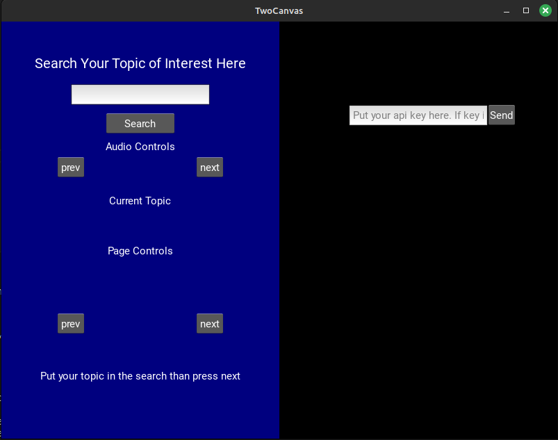

Wikipedia is a good source to get a short-and-sweet rundown of a subject.
Long articles at times may be daunting read, this program helps give an alternative by reading out the article to the user.

Features:
* Read wkipedia articles through TTS
* Use a Stack to keep track of topics in a use cycle
  * So you will be able to get more information on a background page before returning
* Supports Chat-GPT integration for those who have an API key. 

## Installation
Remember to install the requirements.txt file

If the program fails to start, make sure you have a folder named "out" in the home directrory.
